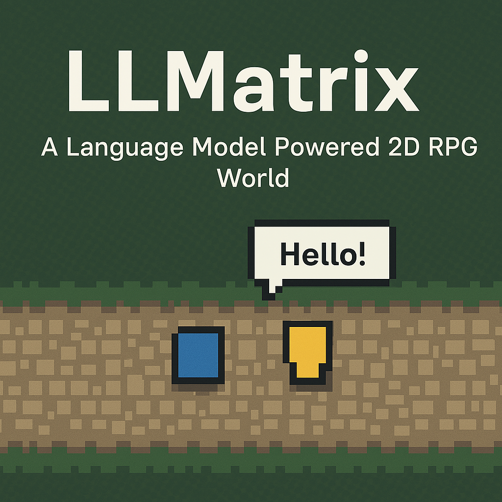

# LLMatrix - A Language Model Powered 2D RPG world

**LLMatrix** is an experimental 2D role-playing game powered by AI language models. The game creates a unique experience where non-player characters (NPCs) can engage in dynamic, intelligent conversations through the OpenAI API.



## 🎮 Key Features

- **AI-Powered NPCs**: NPCs leverage OpenAI's GPT models to provide natural, context-aware conversations
- **Persistent Memory**: NPCs can remember previous interactions with the player
- **Pygame-Based Engine**: Built on the reliable Pygame framework for smooth 2D gameplay
- **Modular Architecture**: Cleanly separated game logic, entity management, and dialogue systems

## 🏗️ Architecture Overview

LLMatrix follows a domain-driven design with these core components:

```
Player ───► Movement
  │
  ▼
Game Engine ───► Dialogue System ───► AI Integration
  │                                       │
  ▼                                       ▼
Entities ◄─────────────────────────── AINPC
```

- **Game Engine**: Orchestrates all game elements and main loop
- **Entities**: Base class for all objects in the game world
- **Player**: Player-controlled character with movement and inventory
- **AINPC**: AI-powered NPCs with conversation capabilities
- **Dialogue System**: Manages text display and user input for conversations

## 🚀 Getting Started

### Prerequisites

- Python 3.8 or higher
- An OpenAI API key

### Installation

1. **Clone the repository**

```bash
git clone https://github.com/yourusername/llmatrix.git
cd llmatrix
```

2. **Set up a virtual environment (recommended)**

```bash
python -m venv venv
source venv/bin/activate  # On Windows: venv\Scripts\activate
```

3. **Install dependencies**

```bash
pip install -r requirements.txt
```

4. **Configure your OpenAI API key**

Set your API key as an environment variable:

```bash
export OPENAI_API_KEY='your-api-key-here'
# On Windows: set OPENAI_API_KEY=your-api-key-here
```

5. **Run the game**

```bash
python main.py
```

## 🎮 How to Play

### Controls

- **Movement**: Arrow keys or WASD
- **Interact with NPCs**: Press ENTER when near an NPC
- **Dialogue Input**: Type your response and press ENTER
- **Exit Dialogue**: Press ESC
- **Toggle NPC Memory**: Press M during conversation
- **Quit Game**: Press ESC when not in dialogue

### Gameplay

Move around the 2D environment as a blue square (the player). Yellow squares represent AI NPCs that you can interact with by pressing ENTER when you're nearby. Have conversations with these NPCs, who will respond intelligently using OpenAI's language models.

## 💻 Development Guide

### Project Structure

```
/llmatrix
├── constants.py   # Game constants (colors, sizes, events)
├── dialogue.py    # Dialogue system with text rendering
├── entities.py    # Entity classes (Player, AINPC)
├── game.py        # Main game logic and loop
├── main.py        # Entry point
└── requirements.txt  # Python dependencies
```

### Adding New Features

#### Creating New NPCs

Add new NPCs in the `game.py` file's `__init__` method:

```python
self.npcs = [
    AINPC(350, 300, YELLOW, self.client, 
          "You are a helpful assistant.", 
          "Hello, how can I assist you today?"),
    # Add a new NPC with different position, color and prompt
    AINPC(500, 200, PURPLE, self.client,
          "You are a mysterious fortune teller.", 
          "I sense you have questions about your future...")
]
```

#### Extending the Dialogue System

The dialogue system in `dialogue.py` uses a state machine pattern to manage different dialogue states. You can extend it by adding new states to the `DialogueState` enum and implementing corresponding logic in the methods.

#### Adding Items and Inventory System

The player already has an inventory list. You can expand on this to implement item collection and usage by:
1. Creating an `Item` class
2. Adding items to the game world
3. Implementing collision detection with items
4. Enhancing the inventory system with usage mechanics

## 📝 Code Examples

### AI NPC Interaction

```python
class AINPC(Entity):
    def interact(self) -> str:
        return self.conversation_history[1]["content"]

    def respond_to_input_async(self, player_input: str) -> None:
        # Implementation handles async API calls to OpenAI
        # and posts a RESPONSE_READY event when complete
```

### Dialogue System

```python
class DialogueSystem:
    # The dialogue system uses a state machine pattern
    # with states for: INACTIVE, SHOWING_DIALOGUE, 
    # INPUT_MODE, and WAITING_FOR_RESPONSE
```

## 🧪 Testing Different Language Models

The project is structured to allow experimenting with different language models. Check the `tests/` directory for examples using Claude, Gemini, and Grok.

## 🤝 Contributing

Contributions are welcome! Here are some ways you can help:

- Adding new features or NPCs
- Improving AI integration
- Enhancing graphics or UI
- Fixing bugs
- Writing documentation

## 📄 License

This project is free to use. If you distribute or modify it, please credit the original author.

## 💡 Future Enhancements

- Support for multiple AI models (Claude, Gemini, etc.)
- Enhanced graphics and animations
- Quest system with AI-generated missions
- Dynamic world generation
- Save/load game functionality

---

*LLMatrix combines the simplicity of 2D gaming with the power of modern language models, creating a playground for exploring the possibilities of AI in interactive entertainment.*