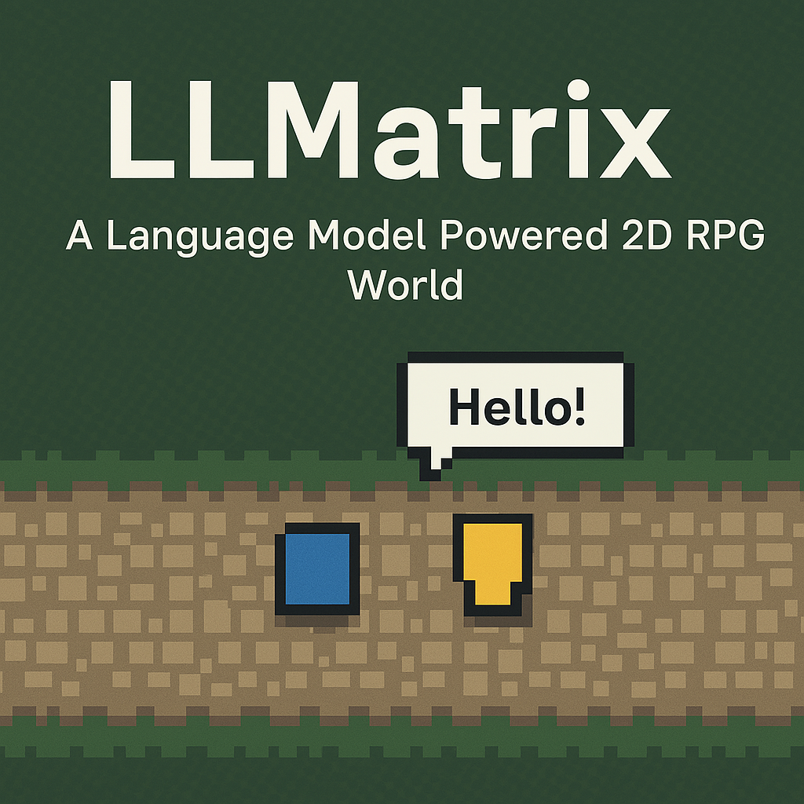

# LLMATRIX - Simple 2D RPG with AI NPCs

<p align="center">
  
</p>


**LLMATRIX** is a simple 2D role-playing game (RPG) built with Pygame, featuring interactive AI-powered non-player characters (NPCs) that leverage OpenAI's API for dynamic conversations. The game includes a player character, NPC interactions, a dialogue system, and basic collision detection with walls. This project serves as a foundation for exploring AI integration in game development.

## Features
- **Player Movement**: Navigate a 2D world using arrow keys or WASD.
- **AI NPCs**: Interact with NPCs powered by OpenAI's GPT-3.5-turbo for natural, context-aware conversations.
- **Dialogue System**: Engage in conversations with NPCs, including text input and responses.
- **Collision Detection**: Walls prevent the player from moving through obstacles.
- **Memory Toggle**: NPCs can optionally retain conversation history or reset it.

## Project Structure
```
/llmatrix
├── tests/               # Test scripts for different implementations
│   ├── main_claude.py
│   ├── main_gemini.py
│   └── main_grok.py
├── .gitattributes       # Git attributes configuration
├── .gitignore           # Git ignore file
├── aitest.py            # Basic AI integration test script
├── constants.py         # Game constants (colors, sizes, etc.)
├── dialogue.py          # Dialogue system implementation
├── entities.py          # Entity classes (Player, AINPC, etc.)
├── game.py              # Main game logic
├── main.py              # Entry point to run the game
├── notes.md             # Project notes
└── README.md            # This file
```

## Prerequisites
- **Python 3.8+**: Ensure Python is installed on your system.
- **Pygame**: For rendering the game.
- **OpenAI API Key**: Required for AI NPC functionality.

## Installation
1. **Clone the Repository**:
   ```bash
   git clone https://github.com/yourusername/llmatrix.git
   cd llmatrix
   ```

2. **Set Up a Virtual Environment** (optional but recommended):
   ```bash
   python -m venv venv
   source venv/bin/activate  # On Windows: venv\Scripts\activate
   ```

3. **Install Dependencies**:
   ```bash
   pip install pygame openai
   ```

4. **Configure OpenAI API Key**:
   - Set your OpenAI API key as an environment variable:
     ```bash
     export OPENAI_API_KEY='your-api-key-here'  # On Windows: set OPENAI_API_KEY=your-api-key-here
     ```
   - Alternatively, add it to a `.env` file and use a library like `python-dotenv` (update `game.py` accordingly).

## Usage
1. **Run the Game**:
   ```bash
   python main.py
   ```

2. **Controls**:
   - **Move**: Arrow keys or WASD
   - **Interact**: Press `Enter` near an NPC
   - **Submit Input**: Press `Enter` while typing in the dialogue box
   - **Backspace**: Delete characters in the input field
   - **Toggle Memory**: Press `M` during an NPC conversation
   - **Exit Dialogue**: Press `Esc`
   - **Quit Game**: Press `Esc` when not in dialogue

3. **Gameplay**:
   - Start in the middle of the screen as a blue square (the player).
   - Move toward the yellow NPC to initiate a conversation.
   - Type responses to interact with the NPC's AI-driven dialogue.

## Code Overview
- **`game.py`**: Core game loop, initializes entities, and handles input.
- **`entities.py`**: Defines `Player` and `AINPC` classes with movement and conversation logic.
- **`dialogue.py`**: Manages the dialogue UI and text input system.
- **`constants.py`**: Centralizes game constants like screen size and colors.
- **`main.py`**: Launches the game.

## Development
- **Adding NPCs**: Create new `AINPC` instances in `game.py` with custom colors, positions, and system prompts.
- **Customizing Dialogue**: Modify the `DialogueSystem` in `dialogue.py` for different styles or behaviors.
- **Testing**: Use the `tests/` directory scripts (`main_claude.py`, `main_gemini.py`, `main_grok.py`) to experiment with alternative implementations.

## Notes
- The game requires an active internet connection for OpenAI API calls.
- NPC memory can be toggled with `M`, affecting whether conversation history persists.
- Error handling for API failures is basic; expect occasional "Sorry, I couldn't respond" messages.
- interesting https://github.com/xdoko01/Game-Console

## Contributing
Feel free to fork this repository, submit issues, or create pull requests. Contributions to enhance the AI, add new features, or improve the UI are welcome!

## License
This project is unlicensed and free to use. If you plan to distribute or modify it, please credit the original author.

## Acknowledgments
- Built with [Pygame](https://www.pygame.org/) and [OpenAI](https://openai.com/).
- Inspired by classic 2D RPG mechanics and modern AI capabilities.
